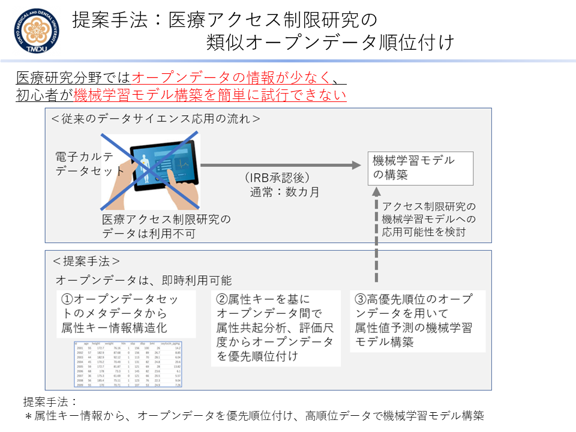
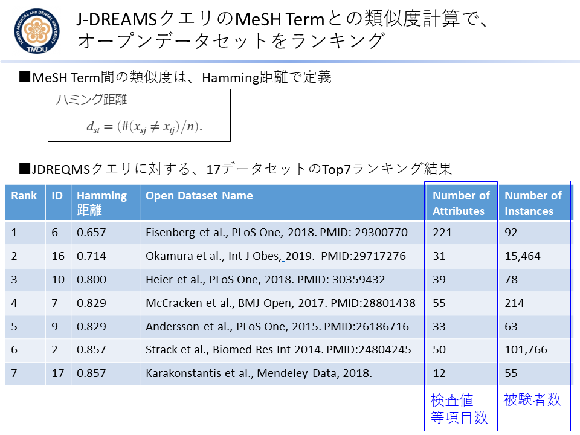

## ROIS-DS-JOINT：The Collaboration Program at ROIS Joint Support-Center for Data Science Research
### データサイエンス基盤研究施設の公募共同研究の成果報告

---

- 2019年度ROIS-DS-JOINT 公募型共同研究 [032RP2019](https://ds.rois.ac.jp/article/2019_rois-ds-joint_result/)　
  - 神沼英里(TMDU), 山本泰智(DBCLS)
  - 課題名「**医療アクセス制限研究の属性共起分析による類似オープンデータ順位付けとデータサイエンス応用**」
  - [2019年度の成果報告スライド](./EK_ROISDS200430.pdf)
  - [2019年11月22日　JSAI合同研究会　スライド発表資料](https://www.slideshare.net/ekaminuma/20191122-jsaimesh-term)
    - 「糖尿病電子カルテを事例としたMeSH Term注釈に基づくアクセス制限研究のオープンデータ類似検索」神沼英里、山本泰智、田中博
  

---  
- 2018年度ROIS-DS-JOINT 公募型共同研究 [029RP2018](https://ds.rois.ac.jp/article/2018rois-ds-joint_result/)　
  - 神沼英里(TMDU), 山本泰智(DBCLS)
  - 課題名「**医療アクセス制限研究の属性共起分析による類似オープンデータ順位付けとデータサイエンス応用**」
  - [2018年度の成果報告スライド](./EK_ROISDS190411.pdf)
     - ＜研究成果概要＞
共同研究初年度である2018年度は、アクセス制限研究をクエリとするオープンデータの順位付け手法を提案し、実工程を確立した。成果として、アクセス制限研究とオープンデータ研究の間で、MeSH Term情報の共起情報分析を行い、距離計算によりオープンデータの優先順位付けを行う手法を提案した。試行実験では、まず全国糖尿病データベース事業J-DREAMSの論文(Sugiyama T, et al., Diabetol Int, 8:375, 2017)から、属性Key情報43項目(注：論文公開分のみ)を収集した。43項目の属性Keyは、35項目のユニークなMeSH Termと紐づけた(Term注釈付け不可分を除く)。次に2018年9月にリリースされたオープンデータの検索ツール「Google Dataset Search」を用いて、「Diabetes」キーワードで検索し、228件のオープンデータのヒットを得た。被験者情報のオープンデータのみを抽出して、最終的に228件から17件(約7%)の電子カルテデータをダウンロードする事が出来た。オープンデータ17件からは、延べ757個の属性Key情報が得られた。オープンデータが持つ最大（最小）属性Key数は221(9)で、中央値は31だった。757個の属性Keyに、197個のユニークなMeSH Termを注釈付けした。複数のオープンデータに存在する注釈付け数大のMeSH Termの例は、「Blood Glucose(血糖値)」「Blood Pressure(血圧)」「Diabetes Mellitus(糖尿病)」等だった。更に、J-DREAMSクエリとMeSH Termの距離が近い順番で、17オープンデータのランキングを試みた。ランキングには、クエリ-オープンデータ間のMeSH Term共起情報によるHamming距離を用いた。J-DREAMSと類似度1位のオープンデータは、属性Key数221項目で被験者数92の2型糖尿病研究 (Eisenberg et al. PLoS ONE, 13: e0190301, 2018)だった。上位5位までの、オープンデータの総被験者数は15,911だった。

  
  <kbd></kbd>  <kbd></kbd>

