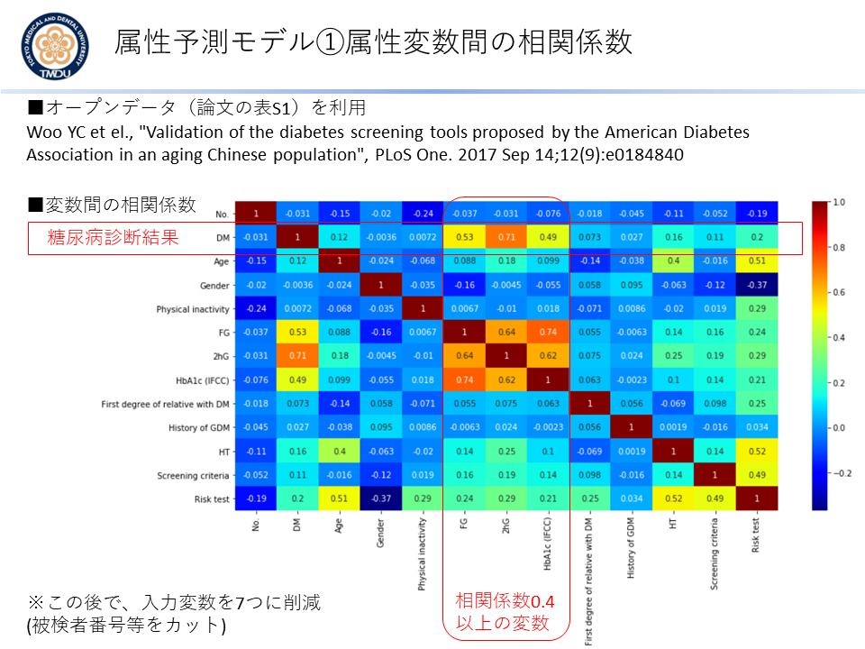

## ROIS-DS-JOINT：The Collaboration Program at ROIS Joint Support-Center for Data Science Research
### データサイエンス基盤研究施設の公募共同研究の成果報告

---

- 2019年度ROIS-DS-JOINT 公募型共同研究 [032RP2019](https://ds.rois.ac.jp/article/2019_rois-ds-joint_result/)　
  - 神沼英里(TMDU), 山本泰智(DBCLS)
  - 課題名「**医療アクセス制限研究の属性共起分析による類似オープンデータ順位付けとデータサイエンス応用**」
  - [2019年度の成果報告スライド](./EK_ROISDS_Slide200429.pdf)
  - [成果プログラム①糖尿病属性分類モデル](./diabetes_opendata.ipynb) 
  - [成果プログラム②DatasetAutoScan:オープンデータWeb Scraping](./datasetautoscan.ipynb) 
     - ＜研究成果概要＞2019年度の継続研究では、ランキング上位のオープンデータの統合結果から属性値予測モデルを構築し、オープンデータ活用の有効性を検証した。また全工程が手作業である提案手法の実用化は、手作業のままではコスト高である為に、オープンデータ順位付け処理の自動化を試みた。糖尿病電子カルテの17のオープンデータから１件を選択して、属性予測モデル構築した。まず被験者数が多く、属性数が少ないデータセットを１件選択した。J-DREAMSに対するオープンデータランキングでは上位8番目の、Woo YCらの香港の高齢者集団を対象とした糖尿病への心血管疾患リスクの調査研究(PMID:28910380)のデータセットである。元論文の目的である心血管疾患リスクテストの属性や、被験者番号属性などを除いた7属性を入力変数として、糖尿病(DM: Diabetes Mellitus)の有無を分類する機械学習モデルを構築した。Google ColaboratoryでPython言語によりXGBoost(勾配ブースティング決定木)アルゴリズムの分類モデルを実装した。被験者のデータは、1,415名（DM=95名）を7：3で訓練とテストに分割した。またGrid Searchにより最適な木構造Depthを決定した。試行分でのテストデータの分類精度は100%（Accuracy）となった。属性変数の重要度を計算した所、2hG(ブドウ糖負荷試験の2時間後血糖値 )が0.91, FG(空腹時血糖値)が0.08, 年齢が0.01となった。HbA1cは0.003と年齢よりも一桁低い重要度となった。自動化では、Web Scrapingによるデータセット自動取得のプログラム開発を行った。まずGoogle Dataset Searchのキーワード検索結果からURLリストを抽出して、BioMed Central等の論文Supplementalデータが得られるFigshareのURLのみに絞り込む。次にFigshareサイトから、1)オープンデータと2)論文情報を得るためのメタデータ(bib形式ファイル)、の2つをGoogle Colabクラウドに取得する。最終的に、Google ColabからLocal PCに全データをダウンロードする流れとした。このWeb Scrapingプログラムで4つの疾患キーワードで5つのデータセットを収集した。5件のオープンデータの属性総数は175件、被験者総数は508名であった。収集した属性は、自動注釈用の学習データを増やす為に昨年度と同プロトコルでMeSH Termを手作業で割り当てた。
<kbd></kbd>
- [2019年11月22日　JSAI合同研究会　スライド発表資料](https://www.slideshare.net/ekaminuma/20191122-jsaimesh-term)
    - 「糖尿病電子カルテを事例としたMeSH Term注釈に基づくアクセス制限研究のオープンデータ類似検索」神沼英里、山本泰智、田中博
  

---  
- 2018年度ROIS-DS-JOINT 公募型共同研究 [029RP2018](https://ds.rois.ac.jp/article/2018rois-ds-joint_result/)　
  - 神沼英里(TMDU), 山本泰智(DBCLS)
  - 課題名「**医療アクセス制限研究の属性共起分析による類似オープンデータ順位付けとデータサイエンス応用**」
  - [2018年度の成果報告スライド](./EK_ROISDS190411.pdf)
     - ＜研究成果概要＞
共同研究初年度である2018年度は、アクセス制限研究をクエリとするオープンデータの順位付け手法を提案した。成果として、アクセス制限研究とオープンデータ研究の間で、MeSH Term情報の共起情報分析を行い、距離計算によりオープンデータの優先順位付けを行う手法についてプログラム実装を行ない「糖尿病(Diabetes)」電子カルテを事例とする試行実験を行った。試行実験では、まず全国糖尿病データベース事業J-DREAMSの論文(Sugiyama T, et al., Diabetol Int, 8:375, 2017)から、属性Key情報43項目(注：論文公開分のみ)を収集した。43項目の属性Keyは、35項目のユニークなMeSH Termと紐づけた(Term注釈付け不可分を除く)。次に2018年9月にリリースされたオープンデータの検索ツール「Google Dataset Search」を用いて、「Diabetes」キーワードで検索し、228件のオープンデータのヒットを得た。被験者情報のオープンデータのみを抽出して、最終的に228件から17件(約7%)の電子カルテデータをダウンロードする事が出来た。オープンデータ17件からは、延べ757個の属性Key情報が得られた。オープンデータが持つ最大（最小）属性Key数は221(9)で、中央値は31だった。757個の属性Keyに、197個のユニークなMeSH Termを注釈付けした。複数のオープンデータに存在する注釈付け数大のMeSH Termの例は、「Blood Glucose(血糖値)」「Blood Pressure(血圧)」「Diabetes Mellitus(糖尿病)」等だった。更に、J-DREAMSクエリとMeSH Termの距離が近い順番で、17オープンデータのランキングを試みた。ランキングには、クエリ-オープンデータ間のMeSH Term共起情報によるHamming距離を用いた。J-DREAMSと類似度1位のオープンデータは、属性Key数221項目で被験者数92の2型糖尿病研究 (Eisenberg et al. PLoS ONE, 13: e0190301, 2018)だった。上位5位までの、オープンデータの総被験者数は15,911だった。

  
  <kbd></kbd>  <kbd></kbd>

